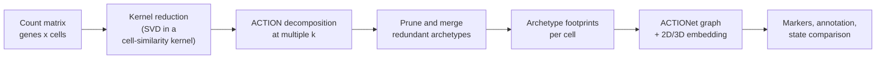

# ACTIONet

**A multiresolution framework for characterizing single-cell state landscapes.**

Most single-cell workflows begin by partitioning cells into discrete clusters.
That is a useful simplification, but it is a simplification: cell identity is
often continuous, cells sit between states, and the resolution at which you
cluster decides what you are able to see.

ACTIONet takes a different route. It combines **archetypal analysis** with
**manifold learning** to describe each cell as a mixture of a small number of
extreme, biologically interpretable states, and it does so at multiple
resolutions at once. Redundant archetypes found at different resolutions are
pruned and merged, leaving a non-redundant set that spans the dataset. The
result is a network, the ACTIONet, in which cells are nodes positioned by their
archetypal composition, with a matching low-dimensional embedding for
visualisation.

Because every cell carries a full vector of archetype weights rather than a
single label, downstream analysis works on continuous cell state: markers,
annotations, and comparisons across datasets all follow from the same
decomposition.



## Where the code lives

This repository is organised by branch rather than by directory. Pick the one
that matches how you want to use ACTIONet:

| Branch | Contents | Status |
| --- | --- | --- |
| [`R-release`](https://github.com/shmohammadi86/ACTIONet/tree/R-release) | R package, stable | Recommended for R users |
| [`R-devel`](https://github.com/shmohammadi86/ACTIONet/tree/R-devel) | R package, development | |
| [`python-release`](https://github.com/shmohammadi86/ACTIONet/tree/python-release) | Python package, stable | Recommended for Python users |
| [`python-devel`](https://github.com/shmohammadi86/ACTIONet/tree/python-devel) | Python package, development | Most recently updated Python branch |
| [`core`](https://github.com/shmohammadi86/ACTIONet/tree/core) | The C++ library both interfaces build on | |
| [`core-devel`](https://github.com/shmohammadi86/ACTIONet/tree/core-devel) | C++ library, development | |
| [`stable_2022`](https://github.com/shmohammadi86/ACTIONet/tree/stable_2022) | Snapshot of the 2022 stable build | Archival |

## Install

### System dependencies

**Debian or Ubuntu**

```bash
sudo apt-get install libhdf5-dev libsuitesparse-dev libblas-dev liblapack-dev cmake
```

**macOS**

```bash
brew install hdf5 suite-sparse c-blosc
```

On Intel hardware, installing the [Intel Math Kernel
Library](https://www.intel.com/content/www/us/en/developer/tools/oneapi/onemkl.html)
and sourcing its `setvars` script so that `MKLROOT` is defined gives a
substantial speedup. If you use MKL, set its thread count explicitly before
running ACTIONet.

### R

```r
install.packages("devtools")
devtools::install_github("shmohammadi86/ACTIONet", ref = "R-release")
```

Full instructions, including installing the dependencies separately and
building from a clone, are in the
[`R-release` README](https://github.com/shmohammadi86/ACTIONet/tree/R-release).

### Python

Requires CMake 3.19 or newer.

```bash
pip install git+https://github.com/shmohammadi86/ACTIONet@python-devel
```

Full instructions are in the
[`python-devel` README](https://github.com/shmohammadi86/ACTIONet/tree/python-devel).

## Quick start

```python
import ACTIONet as an
import scanpy as sc

adata = sc.read_10x_h5('pbmc_10k_v3.h5')
adata.var_names_make_unique(join='.')
an.pp.filter_adata(adata, min_cells_per_feature=0.01, min_features_per_cell=1000)
sc.pp.normalize_total(adata)
sc.pp.log1p(adata)

an.pp.reduce_kernel(adata)
an.run_ACTIONet(adata)

markers, directions, names = an.tl.load_markers('PBMC_Monaco2019_12celltypes')
labels, confidences, Z = an.tl.annotate_cells_using_markers(adata, markers, directions, names)
adata.obs['celltypes'] = labels

an.pl.plot_ACTIONet(adata, 'celltypes', transparency_key='node_centrality')
```

## Related packages

| Package | Purpose |
| --- | --- |
| [ACTIONetExperiment](https://github.com/shmohammadi86/ACTIONetExperiment) | The R container ACTIONet stores its results in; a SummarizedExperiment shaped like AnnData |
| [ATACtion](https://github.com/shmohammadi86/ATACtion) | ACTIONet for single-cell chromatin accessibility |
| [SCINET](https://github.com/shmohammadi86/SCINET) | Cell-type-specific interactomes, built on ACTIONet cell states |
| [ACTION](https://github.com/shmohammadi86/ACTION) | The original ACTION algorithm, in C++ with MATLAB and R interfaces |

## Citation

> Mohammadi, S., Davila-Velderrain, J., & Kellis, M. (2020).
> **A multiresolution framework to characterize single-cell state landscapes.**
> *Nature Communications*, 11, 5399.
> https://doi.org/10.1038/s41467-020-18416-6

For the underlying archetypal decomposition:

> Mohammadi, S., Ravindra, V., Gleich, D. F., & Grama, A. (2018).
> **A geometric approach to characterize the functional identity of single
> cells.** *Nature Communications*, 9, 1516.
> https://doi.org/10.1038/s41467-018-03933-2

`CITATION.cff` is included, so GitHub's "Cite this repository" button will
generate BibTeX and APA entries.

## Getting help

Please open a [GitHub issue](https://github.com/shmohammadi86/ACTIONet/issues)
for bug reports and questions. Include the branch you installed from, your
platform, and the output of `sessionInfo()` or `an.__version__`.

## License

GPL (>= 2).
